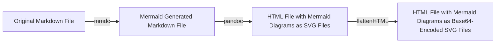

# markdown2html
Converts a Markdown File (with or without embedded Mermaid diagrams) into a complete HTML file

All mermaid diagrams are compiled to SVG using `mmdc` 

## Overview



## Prerequisites

* Python 3.9+
* Pandoc 3.0+
* Mermaid CLI 11.0+
  * This will require a Chrome-based browser
  * See the [mmdc documentation](https://mermaid.js.org/supported-tools/mermaid-cli.html) for more details

## Usage Options

### Windows/Powershell

1. Set up a Python virtual environment
   ```powershell
   python -m venv venv
   .\venv\Scripts\Activate.ps1
   ```
1. Install the required packages
   ```powershell
   pip install -r requirements.txt
   ```
1. Install `pandoc` and `mmdc`
   ```powershell
   # Using chocolatey for this example
   choco install pandoc

   # Installing mmdc globally
   npm i -g @mermaid-js/mermaid-cli
   ```
1. Rename `config.template.json` as `config.json` and fill in the values
1. Run the script
   ```powershell
   & .\md2html.ps1 -File C:\Path\To\Markdown\File.md
   ```
1. The resulting HTML file will be stored in the same directory as the markdown file

### Linux/Bash

1. Set up a Python virtual environment
   ```bash
   python3 -m venv venv
   source venv/bin/activate
   ```
1. Install the required packages
   ```bash
   python -m pip install -r requirements.txt
   ```
1. Install `pandoc` and `mmdc`
   ```bash
   sudo apt install pandoc

   npm i -g @mermaid-js/mermaid-cli
   ```
1. Rename `config.template.json` as `config.json` and fill in the values
1. Run the script
   ```bash
   ./md2html.sh -f /path/to/markdown/file.md
   ```

## Template Changes

All the CSS and JS files are base64-encoded to keep the HTML fully portable and self-contained. The assets used for those files are stored in the `assets` directory. 

### HighlightJS Theme

The HighlightJS theme can be changed by loading a new base64-encoded) string replacing this line:
```html
  <!-- Github Dark Dimmed HighlightJS CSS -->
  <link rel="stylesheet" type="text/css" href="data:text/css;base64,<BASE64_VALUE>">
```
with your new theme name and value.

`https://cdnjs.cloudflare.com/ajax/libs/highlight.js/11.9.0/styles/<THEME_NAME>.min.css`
